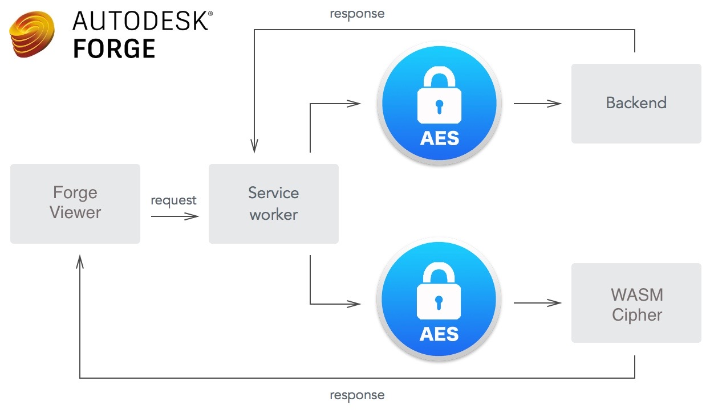

[](https://nodejs.org/)
[](https://www.rust-lang.org/)
[](https://webassembly.org/)
[](http://opensource.org/licenses/MIT)

[](http://forge.autodesk.com/)
[](http://forge.autodesk.com/)
[](https://hapi.dev)
[](https://github.com/standard/standard)

## Description

A sample project to protect and load encrypted derivatives on Autodesk Forge Viewer with WebAssembly and stream ciphers.

See details in the accompanying blog article here: https://forge.autodesk.com/blog/load-encrypted-model-data-webassembly-and-rust

## Prerequisites

- Install [Node.js](https://nodejs.org/en/download/)

- Install [Rust](https://www.rust-lang.org/tools/install)

- Install `wasm-pack`: `cargo install wasm-pack`

- Install `cargo-edit`: `cargo install cargo-edit`

## Setup and Run

- Clone the project and proceed to its directory in CLI

- `npm install` //run once to install dependencies

- Put the translated model files (SVF) to `src/client/public/models` or `public/models` - you can translate and download the model files on extractor.io or use sample files (all files in the directory required) [here](https://github.com/dukedhx/viewer-javascript-offline.sample/tree/gh-pages/shaver)

- `export (or set for Windows) svf_path=path/to/`  //or replace the variable in `src/client/index.js` with relative path to the SVF e.g. `model/office/0.svf`

- `npm run build`  //run once to build the app

- `npm start` //start the app and browse to http://localhost:3000


## Project Structure

```
src —- client  //frontend JS source
    |- server  //backend node.js source
    |- wasm    //WASM Rust source
    |- public  //static assets
```

Security and intellectual property protection has arguably been a high priority concern for Forge and BIM developers at large. With Forge our strengthening measures include the enforcement of TLS 1.2 for all Forge endpoints(https://forge.autodesk.com/blog/upcoming-forge-system-upgrade-tls-12-upgrade-date-moved-oct-31) as well as the proxy service approach discussed here(https://forge.autodesk.com/blog/securing-your-forge-viewer-token-behind-proxy). But what if the token itself becomes part of the attack surface when it gets stolen, or even the client agent is compromised? As a countermeasure to these extreme (but quite likely) scenarios, is it possible to secure the derivatives (translated model files) during their entire transmission cycle with encryption, decrypt securely on the client side (yes the browsers) and load them with Viewer? The answer is yes thanks to the emergence of WebAssembly so we can rest assured that your model files are safe against token theft or client side breach.

## Architectural Overview

We are going to implement server side encryption with streamed cipher to serve and encrypt protected resources on the fly, and then decipher in real time with client side decryption in WebAssembly. Once again our workflow today will be marshaled by our recurring guest star - Service Worker - so you might want to read up on these relevant topics ( https://forge.autodesk.com/blog/disconnected-workflows and https://forge.autodesk.com/blog/implement-retry-custom-query-string-and-more-viewer-service-worker) if you haven’t before continuing.



### Design Rationale

Service Worker is without a doubt indispensable as it is necessary to intercept Viewer’s load requests and to achieve code-splitting by injecting the decipher in a non-intrusive manner w/o impacting the rest of our app.

However would it be an overkill to involve WebAssembly since it is entirely possible to decipher almost every cryptographic algorithm in pure JavaScript? Programmatically probably yes - but if we did so all the code would be exposed and the implementation details of the decipher would be inevitably transparent to the attackers and hence become an attack vector itself. With WebAssembly our decipher would be compiled to assembly level code which would be reasonably complex to reverse engineer. And performance wise our JavaScript decipher might lag behind WebAssembly by some distance as well.

### WebAssembly - A Game Changer for Web Apps

WebAssembly (WASM), in a nutshell, is new type of code that can be run in modern web browsers and other platforms (Node.js etc) — it is a low-level assembly-like language with a compact binary format that runs with near-native performance. See browser support as of 2019.10 below and we can see its production readiness is a lot better if compared year over and that attests to momentum that WASM is gaining of late:


WebAssembly provides languages such as C/C++ and Rust with a compilation target so that they can run on the web. It is also designed to run alongside JavaScript, allowing both to work together.

As of 2019.10 we can use compilers (Emscripten etc.) to compile the following languages to WebAssembly:


### Rust - Blazingly Fast and Memory-efficient: Without Runtime or Garbage Collector

Rust is a multi-paradigm system programming language focused on safety, especially safe concurrency. Rust’s rich type system and ownership model guarantee memory-safety and thread-safety and enable you to eliminate many classes of bugs at compile-time.


While it is conceivable that one day people will be writing the latest 3D video games in Rust — an area where high performance has historically been critical — it is unlikely ever to have a web framework that will go toe-to-toe with Ruby on Rails.

Rust is our language of choice to implement the client side cipher because WebaAssembly is among its default compilation targets and we get to benefit from its memory features, sleek syntax and impressive ecosystem with powerful tools like cargo and wasm-pack.

Server Side Encryption - Node.js Crpto

In our backend we are using the crypto module of the Node.js standard library to create a stream cypher to encrypt on the fly files under the model folders as we serve them - just so the model files themselves can be stored as is w/o physical encryption, giving us the flexibility to change salt, keys and even the encryption algorithm when we want to and keep the files directly accessible internally to other modules or apps all the while. To do this our route handler looks like:

```
//src/server/index.js
    server.route({
    method: 'GET',
    path: '/models/{file*}',
    handler: (request, h) => {

        const filepath = path.join(__dirname,'../../public/models',request.params.file);
        if(!fs.existsSync(filepath)) return h.response().code(404);
      const  cipher = crypto.createCipheriv('aes-192-ctr', key, Buffer.alloc(16, 0));
      return h.response(fs.createReadStream(filepath).pipe(cipher))
    }});
```

### Client Side Decryption - Rust WASM

Given the limited types available to exchange between WASM and JavaScript we will pass the read chunks to Rust as u8 (8 bit unsigned integer) vector and as Uint8Array from JavaScript. And since there’s no other media than the exchangeable, primitive types and shared memory available to interchange object references or convey and persist application states we will employ a static map (URL as key to perfectly avoid racing conditions) to hold the ciphers and enclose them with mutex to allow themselves to be mutable so their own states can be persisted to decipher the streams properly - this will serve us just fine as the WASM instance is going to live through the entirety of Service Worker life cycle.

```
//src/wasm/src/lib.rs
lazy_static! {
     static ref cipherMap:Mutex<HashMap<String,Mutex<Aes192Ctr>>> = Mutex::new(HashMap::new());  // URL to cipher map
}

#[wasm_bindgen]
pub fn decrypt(mut buffer: &mut[u8], key: &str) -> Vec<u8> {
    let mut cipherMapLock = cipherMap.lock().unwrap();
    let stringKey = String::from(key);
    if !cipherMapLock.contains_key(&stringKey)
    {
        let cipherKey = hex::decode("6b65796b65796b65796b65796b65796b65796b65796b6579").unwrap();
        cipherMapLock.insert(stringKey.to_string(), Mutex::new(Aes192Ctr::new_var(&cipherKey, &[0; 16]).unwrap()));  //create cipher and add to static map
    }

    let mut cipher = cipherMapLock.get(&stringKey).unwrap().lock().unwrap();

    cipher.apply_keystream(&mut buffer);  // decrypt chunk and move the cipher
    buffer[..].to_vec()
}

#[wasm_bindgen]
pub fn finish(key: &str)  {
    cipherMap.lock().unwrap().remove(&String::from(key));
    ()   //returns nothing
}
```

In our Service Worker we load and instantiate the WASM module - note that with the Service Worker Webpack plugin we can happily delegate and abstract that away by importing the WASM module directly into your JS code, but since that’d require a dynamic import that is not exactly supported for now by Service Worker so we’d need to instantiate explicitly with our own code:

```
//src/client/sw.js
WebAssembly.compileStreaming(fetch(`/${wasm_package_name}_bg.wasm`)).then(mod => WebAssembly.instantiate(mod, { imports: {} }).then(instance => {
  self.wasm = instance.exports    //expose WASM exports for the glue code
  self.clients.matchAll().then(clients => clients[0].postMessage('tryinitViewer')) //notify that the WASM is ready
}))
```

Then we set up to intercept responses, apply our own reader and response stream. Here we see one crucial benefit of using wasm-pack to compile our WASM module as it automatically produces JS glue code that enables us to pass and receive chunks to WASM by calling its methods as easily as an ordinary JS function:

```
//src/client/index.js
self.addEventListener('fetch', event => {
  event.respondWith(
    async function () {
      if (/http\:\/\/(\w|\:)+\/models/.test(event.request.url)) {
        const response = await fetch(event.request)
        if (response.status != 200) return response
        const reader = response.body.getReader()
        const url = event.request.url
        const stream = new ReadableStream({
          start (controller) {
            function push () {
              reader.read().then(({ done, value }) => {
                if (done) {
                  controller.close()  //finish reading the response stream
                  finish(url) //remove the cipher when done
                  return
                }
                controller.enqueue(decrypt(value, url)) //decrypt the buffered chunk
                push()  //read and decrypt the response stream recursively
              })
            };

            push()
          }
        })

        return new Response(stream)  //return the decrypted response
      } else return fetch(event.request)
    }())
})
```

## Tips and Tricks

> How to modify or compile the Rust WASM alone?

Rust source is at `src/wasm` and you can use wasm-pack to compile separately.

> Can this be adopted for other use than Viewer?

Yes both the WASM and backend ciphers are generic purpose.

> Any limitations/security concerns for this approach?

See the last section of the corresponding blog article.

## License

[MIT](http://opensource.org/licenses/MIT)

## Written By

[Bryan Huang](https://www.linkedin.com/in/bryan-huang-1447b862) - Forge Partner Development https://forge.autodesk.com
